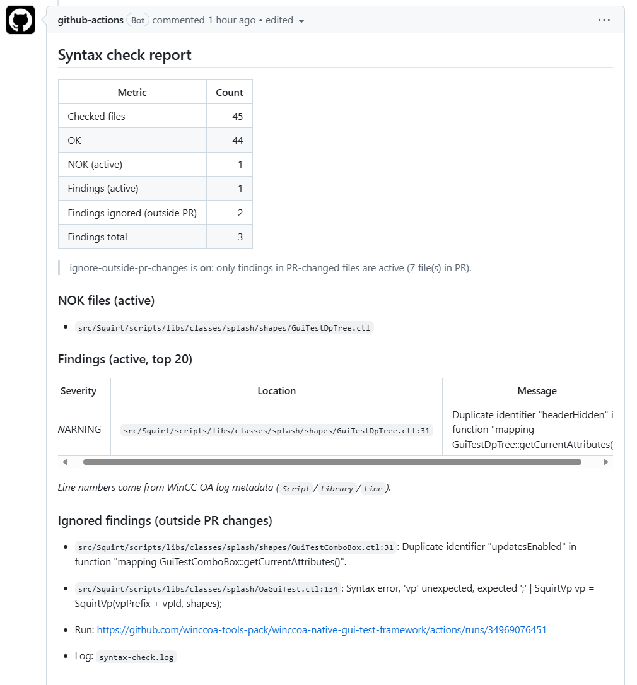
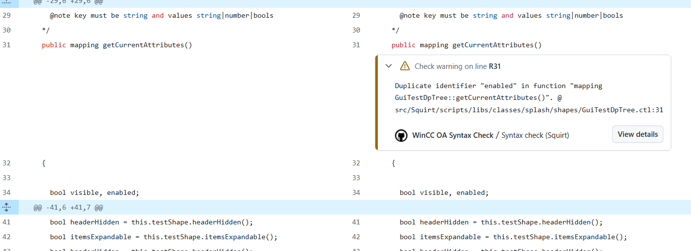
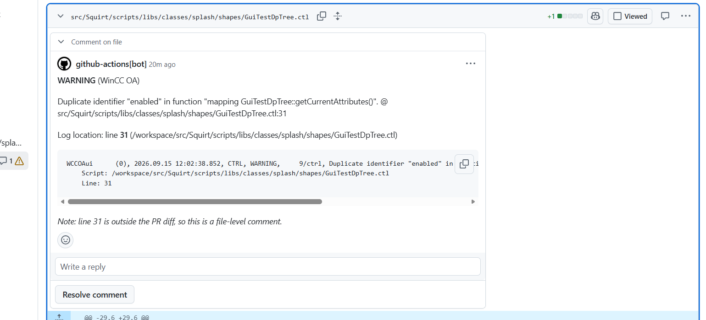

# WinCC OA Logs to PR Review

Parse classic WinCC OA logs (`PVSS_II.log` shape / WCCOAui `-syntax` stderr)
with [`@winccoa-tools-pack/npm-winccoa-log-reader`](https://www.npmjs.com/package/@winccoa-tools-pack/npm-winccoa-log-reader)
and publish a quick PR report:

- **OK / NOK file counts** (from `PARAM,INFO` checked paths minus findings)
- Optional **PR review comments** on Script/Library line locations
- Always emits GitHub **workflow annotations** for findings (capped)
- Optional **ignore findings outside PR changed files** (default off)

Pair this action with
[`winccoa-syntax-check`](../winccoa-syntax-check/README.md) (or any step that
writes a classic OA log) so reviewers see syntax noise without opening the
artifact.

## What it looks like on a PR

### Summary comment (Conversation tab)

One bot issue comment is **upserted** per `comment-marker`. Metrics distinguish
**active** findings from those **ignored** because they sit outside the PR file
list (when `ignore-outside-pr-changes` is enabled).



The comment includes:

| Section | Meaning |
| --- | --- |
| Checked / OK / NOK (active) | Files walked by OA and files with active findings |
| Findings (active) | Count used for annotations, review comments, and `fail-on-findings` |
| Findings ignored (outside PR) | Baseline noise not in this PR’s changed files |
| Findings (active, top 20) | Table of severity, path:line, and cleaned message |
| Ignored findings | Same detail for out-of-PR files (still visible, not blocking) |

### Inline review comment (Files changed)

When `review-comments: true` and the log line falls inside the PR diff, GitHub
shows a normal line comment:



### Outside the visible diff range

OA `Script` / `Library` / `Line` metadata often points at a **function** line
(or another line not in the PR hunk). GitHub then rejects a line-anchored
comment (`422`). The action falls back to a **file-level** review comment and
notes that the line is outside the visible range:



Workflow **annotations** still carry `file=` / `line=` for the Checks UI even
when the review API cannot attach to that line.

## Runtime

- Linux runners with Node 20+ (bootstraps Node when missing)
- Needs `pull-requests: write` (and usually `contents: read`) when commenting
  or when `ignore-outside-pr-changes` is enabled (lists PR files via API)
- Intended to run after `winccoa-syntax-check` (or any step that produces a
  classic OA log)
- Prefer a workflow `concurrency` group with `cancel-in-progress: true` on the
  same PR so overlapping runs do not race while posting

## Inputs

| Input | Required | Default | Description |
| --- | --- | --- | --- |
| `log-path` | yes | - | Classic OA log file path |
| `title` | no | `WinCC OA log report` | PR comment heading |
| `comment-marker` | no | `<!-- winccoa-logs-to-pr-review -->` | Upsert marker for the summary issue comment |
| `comment-on-pr` | no | `true` | Upsert PR issue comment |
| `review-comments` | no | `false` | Try PR line / file review comments |
| `fail-on-findings` | no | `false` | Fail step when **active** (non-ignored) findings remain |
| `ignore-outside-pr-changes` | no | `false` | On `pull_request`, ignore findings in files not changed in the PR (file-level). Default off. Useful for legacy repos with baseline syntax noise. |
| `annotate-ignored` | no | `false` | When ignoring outside PR changes, still emit workflow annotations for ignored findings |
| `severities` | no | `WARNING,SEVERE,FATAL` | Severities treated as findings |
| `include-error-types` | no | empty | Optional type filter (e.g. `CTRL`) |
| `path-strip-prefixes` | no | `/workspace/` | Prefixes stripped from absolute paths |
| `summary-path` | no | `.artifacts/winccoa-log-report.json` | JSON summary output |
| `package-version` | no | `0.1.1` | npm version of log-reader |
| `node-version` | no | `22` | Node major when bootstrapping |
| `github-token` | no | `github.token` | Token for PR APIs and PR file listing |

## Outputs

| Output | Description |
| --- | --- |
| `ok-count` | Files checked without **active** findings |
| `nok-count` | Unique files (or system bucket) with **active** findings |
| `finding-count` | Active (non-ignored) matching findings |
| `finding-count-total` | Matching findings before ignore filter |
| `ignored-count` | Findings ignored because outside PR changes |
| `checked-count` | Unique checked files discovered |
| `summary-path` | Absolute path to JSON summary |

Use `finding-count` (active) for PR quality gates. Use
`finding-count-total` / `ignored-count` only for metrics and debugging.

## Behavior details

### Summary comment vs review comments

| Channel | Dedup | Content |
| --- | --- | --- |
| Issue comment (Conversation) | Upsert by `comment-marker` | Full OK/NOK table, active + ignored lists, run link |
| Review comments (Files changed) | **Replace each run**: delete previous bot line comments that carry this action’s marker, then post fresh ones | Active findings only (not ignored) |
| Workflow annotations | Emitted every run (capped) | Active by default; include ignored if `annotate-ignored: true` |

Re-running the workflow therefore updates one summary and does **not** stack
duplicate line comments on the same finding.

### `ignore-outside-pr-changes`

1. On `pull_request` only, list changed paths via the Pulls Files API.
2. Mark a finding **ignored** when its file does not match any PR path
   (suffix / normalized path match).
3. Findings with no file path stay **active**.
4. Matching is **file-level**, not hunk/line-level: any finding in a touched
   file stays active even if the bad line is outside the diff.

Gate the job on report outputs, not only on the syntax step outcome:

```yaml
- id: syntax
  continue-on-error: true
  uses: .../winccoa-syntax-check@main
  with:
    fail-on-error: 'true'

- id: report
  if: always() && github.event_name == 'pull_request'
  uses: .../winccoa-logs-to-pr-review@main
  with:
    ignore-outside-pr-changes: 'true'
    fail-on-findings: 'false'   # optional; often the next step fails instead

- if: always() && github.event_name == 'pull_request'
  run: |
    if [ "${{ steps.report.outputs.finding-count }}" -gt 0 ]; then
      exit 1
    fi
```

If you fail solely on `steps.syntax.outcome == 'failure'`, baseline findings
outside the PR still fail the job even when the report ignored them.

### Line numbers and messages

- Locations come from OA log metadata (`Script` / `Library` / `Line`).
- Duplicate-identifier warnings often point at the **function** line, not the
  second declaration.
- Messages are cleaned (trailing empty `Location:` removed) and annotated with
  path/line/snippet for the table and review body.

### Debug output in the job log

The step prints:

- `--- filtered-log-json-begin ---` … full filtered entries + counts +
  `prChanges`
- `--- summary-json-begin ---` … written summary file contents
- Machine lines: `OK_COUNT=`, `NOK_COUNT=`, `FINDING_COUNT=`,
  `FINDING_COUNT_TOTAL=`, `IGNORED_COUNT=`, …

## Example (with syntax-check)

```yaml
permissions:
  contents: read
  packages: read
  pull-requests: write

concurrency:
  group: syntax-check-${{ github.workflow }}-${{ github.event.pull_request.number || github.ref }}
  cancel-in-progress: true

jobs:
  syntax:
    runs-on: ubuntu-latest
    steps:
      - uses: actions/checkout@v4

      - id: syntax
        continue-on-error: true
        uses: winccoa-tools-pack/github-actions-winccoa/actions/winccoa-syntax-check@main
        with:
          path: src/Squirt
          winccoa-version: '3.21'
          docker-image: ghcr.io/winccoa-tools-pack/winccoa:v3.21.3-debian12-all
          fail-on-error: 'true'

      - id: report
        if: always() && github.event_name == 'pull_request'
        uses: winccoa-tools-pack/github-actions-winccoa/actions/winccoa-logs-to-pr-review@main
        with:
          log-path: ${{ steps.syntax.outputs.log-path }}
          title: Syntax check report
          comment-marker: '<!-- winccoa-syntax-check-report -->'
          include-error-types: CTRL
          review-comments: 'true'
          # Legacy baseline: only fail on findings in files this PR touches
          ignore-outside-pr-changes: 'true'
          fail-on-findings: 'false'

      # PR: fail only on active findings. Push: fail if syntax step failed.
      - if: always()
        run: |
          if [ "${{ github.event_name }}" = "pull_request" ]; then
            FINDINGS="${{ steps.report.outputs.finding-count }}"
            FINDINGS="${FINDINGS:-0}"
            if [ "$FINDINGS" -gt 0 ]; then
              echo "::error::Active syntax findings: $FINDINGS"
              exit 1
            fi
            exit 0
          fi
          if [ "${{ steps.syntax.outcome }}" = "failure" ]; then
            echo "::error::Syntax check failed"
            exit 1
          fi
```

## Screenshots

Assets live under [`docs/`](docs/):

| File | Description |
| --- | --- |
| [`report-example.png`](docs/report-example.png) | Upserted Conversation summary (active + ignored) |
| [`inline-comment.png`](docs/inline-comment.png) | Line review comment inside the PR diff |
| [`out-of-visible-range-comment.png`](docs/out-of-visible-range-comment.png) | File-level fallback when the OA line is outside the visible range |

## Notes

- OK inventory prefers `PARAM,INFO` lines emitted while WCCOAui walks files.
  If those lines are missing, OK may be `0` and only NOK files are listed.
- Never pin the npm package to a git ref such as `main`; use a published
  version or dist-tag (`0.1.1`, `latest`).
- Token needs permission to delete prior review comments when
  `review-comments` is enabled (default `GITHUB_TOKEN` with
  `pull-requests: write` is enough on the same repo).

---

<!-- markdownlint-disable-next-line MD033 -->
<center>Made with ❤️ for and by the WinCC OA community</center>
